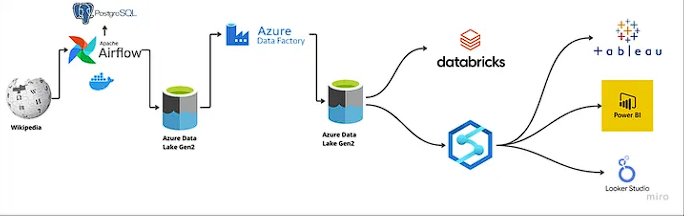
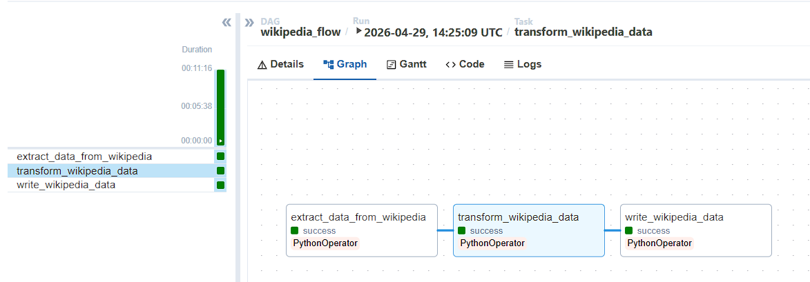
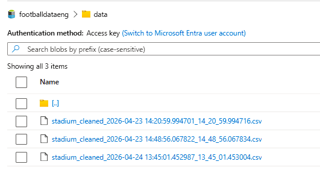
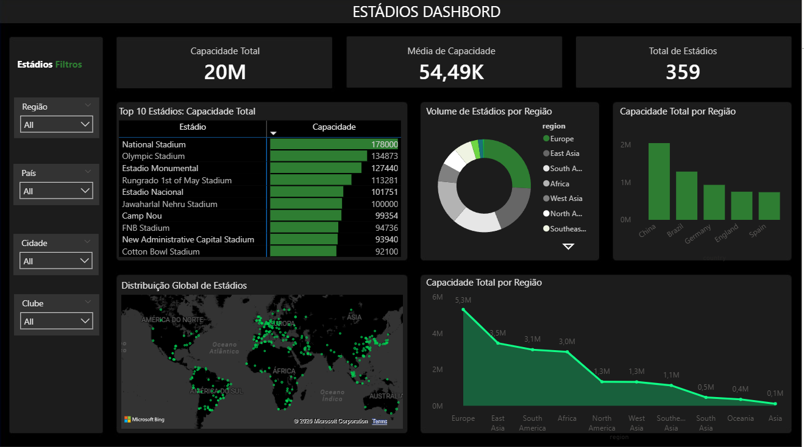

# 🏟️ Global Stadiums Analytics: End-to-End Data Pipeline

## 📌 Visão Geral
Este projeto consiste em uma pipeline de dados completa que extrai, processa e visualiza informações sobre a capacidade de estádios de futebol ao redor do mundo. O fluxo abrange desde o web scraping de dados não estruturados até a criação de um dashboard executivo, utilizando tecnologias líderes de mercado para orquestração e análise em nuvem.

  

---

## 🛠️ Tech Stack
| Categoria | Tecnologia |
| :--- | :--- |
| **Orquestração** | Apache Airflow (Dockerized) |
| **Linguagem** | Python (BeautifulSoup, Pandas, Geopy/OpenCageData) |
| **Cloud (Azure)** | Data Lake Storage Gen2, Data Factory e Synapse Analytics |
| **Visualização** | Power BI |
| **Banco de Dados** | PostgreSQL (Meta-database do Airflow) |

---

## 🏗️ Arquitetura e Fluxo de Dados

### 1. Extração e Ingestão (Bronze Layer)
* Utilizamos o **Airflow** para orquestrar a extração de dados da Wikipedia (*"List of association football stadiums by capacity"*).
* O script de extração utiliza **BeautifulSoup** para percorrer o HTML da página, decompor as células da tabela e rotulá-las em colunas estruturadas.
* Implementamos funções de limpeza de dados para remover caracteres indesejados e tags HTML durante o loop de extração.

### 2. Processamento e Enriquecimento (Silver Layer)
* **Persistência de Dados:** Utilizamos o método **XCom** do Airflow para transferir dados entre tarefas em formato JSON, garantindo que as tasks de transformação tenham acesso aos dados extraídos.
* **Geolocalização:** Integramos a API **OpenCageData** para adicionar coordenadas de latitude e longitude a cada estádio.
* **Lógica de Fallback:** Para evitar coordenadas duplicadas, a pipeline utiliza uma lógica que alterna entre a busca por *"Estádio + País"* e *"Cidade + País"*, aumentando a precisão do mappings.
* 

  

### 3. Cloud Data Warehouse (Gold Layer)
* **Azure Data Lake:** Os dados processados são carregados no Azure Storage Account em um container dedicado, utilizando timestamps para evitar a sobreposição de arquivos.
* **Azure Data Factory:** Pipelines de *Copy Data* migram os dados da camada de ingestão para a camada pronta para análise.
* **Azure Synapse:** O workspace do Synapse é utilizado para realizar queries analíticas avançadas em um ambiente de SQL Serverless, conectando diretamente ao Data Lake.

  

---

## 📊 Visualização (Dashboard)
O dashboard final no Power BI foi projetado com foco em UX/UI Dark Mode, apresentando os seguintes insights:

* **KPIs de Escala:** Capacidade Total acumulada (20M) e Média de Capacidade (54.49K).
* **Volume de Estádios:** Distribuição por região e contagem total de registros analisados (359 estádios).
* **Ranking:** Top 10 estádios globais por capacidade individual.
* **Geolocalização:** Mapa interativo utilizando coordenadas decimais tratadas no Power Query.

  

---

## 🚀 Desafios Técnicos e Aprendizados
* **Resiliência de API:** Enfrentamos erros de permissão (403 Forbidden) com o Geopy, resolvidos através da migração estratégica para a API OpenCageData.
* **Ambiente Isolado:** O uso do Docker Compose permitiu configurar a comunicação entre o Airflow e o PostgreSQL sem dores de cabeça com configurações locais de ambiente.
* **Tratamento de Dados:** A limpeza rigorosa via Python e a posterior categorização de dados geográficos no Power BI foram cruciais para a precisão dos visuais de mapa.
